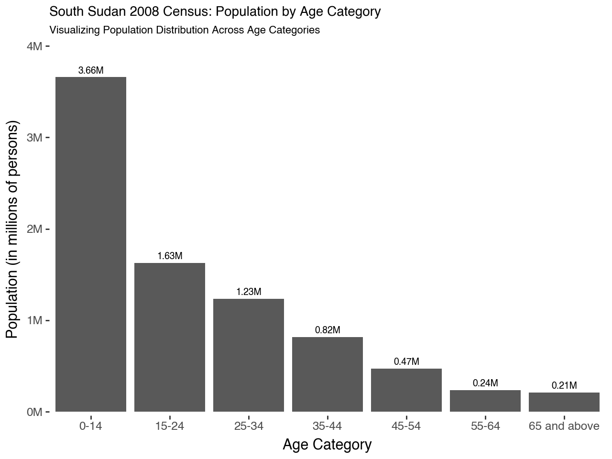
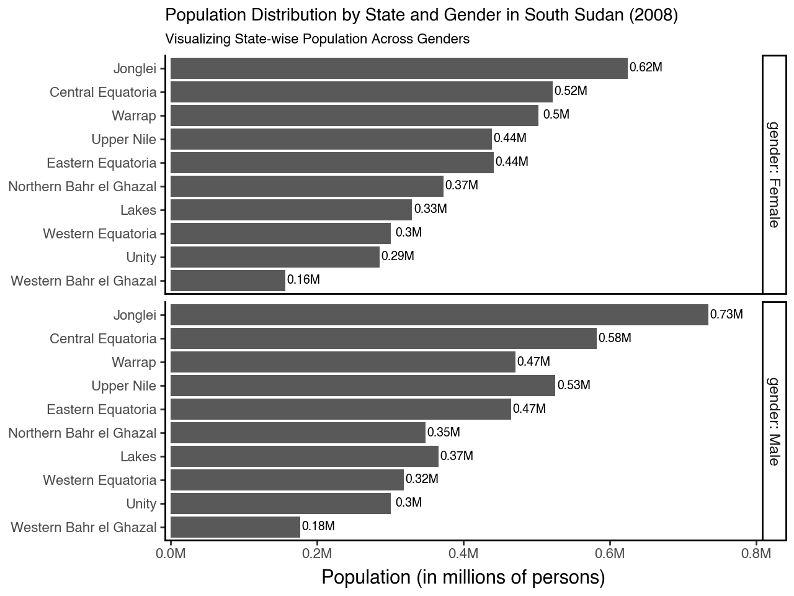

# Data Visualization with Plotnine

Welcome to the Data Visualization with Plotnine repository! This repository showcases elegant data visualizations created using the powerful plotnine library in Python. Here, you will find a collection of tutorials and examples that demonstrate the capabilities of plotnine for creating stunning and informative visualizations.

## Table of Contents

- Introduction
- Getting Started
- Examples
- Tutorials
- License

## Introduction

plotnine is a Python library based on the Grammar of Graphics, similar to the ggplot2 package in R. It allows you to create complex and customizable plots with ease. This repository aims to help data scientists and analysts leverage plotnine for their data visualization needs, bridging the gap between R and Python.

## Getting Started

To get started with plotnine, you need to install the required packages. This repository includes a requirements.txt file that lists all necessary dependencies. You can install these packages using the following command:

pip install -r requirements.txt

## Examples

This section contains various examples of data visualizations created with plotnine. Each example includes the code and a description of the visualization. Here are a few highlights:

```{python}
# Loading Libraries
import polars as pl
import polars.selectors as cs
from plotnine import *
from mizani.labels import label_number
```

1. Population Distribution by State and Gender

```{python}
(
    ggplot(gender, aes('reorder(state, total)', 'total'))
    + geom_col(position='dodge')
    + geom_text(aes(label='labels'), format_string='{}M', nudge_y=25_000, size=7)
    + scale_x_discrete(expand=(0.01, 0.01))
    + scale_y_continuous(
        limits=(0, 800_000), 
        expand=(0.01, 0.01),
        labels=label_number(scale=1e-6, suffix='M')
    )
    + facet_grid('gender', scales='free_y', labeller='label_both')
    + coord_flip()
    + theme_classic()
    + labs(
        x='',
        y='Population (in millions of persons)',
        title='Population Distribution by State and Gender in South Sudan (2008)',
        subtitle='Visualizing State-wise Population Across Genders'
    )
    + theme(
        plot_title=element_text(size=10, margin={'t': 10, 'b': 10}),
        plot_subtitle=element_text(size=8, margin={'b': 10}),
        axis_text=element_text(size=8),
        axis_title_y=element_text(size=8)
    )
)
```



2. Visualizing Population Distribution Across Age Categories

```{python}
# Visualize the 2008 South Sudan Census by Former Region
(
    ggplot(age, aes('category', 'total'))
    + geom_col(stat='identity', width=0.7) 
    + geom_text(aes(label='labels'), format_string='{}M', nudge_y=70_000, size=7)
    + scale_y_continuous(
        limits=(0, 4_000_000), 
        expand=(0.01, 0.01),
        labels=label_number(scale=1e-6, suffix='M')
    )
    + scale_x_discrete(expand=(0.01, 0.01))
    + theme_tufte() 
    + labs(
        x='Age Category',
        y='Population (in millions of persons)',
        title='South Sudan 2008 Census: Population by Age Category',
        subtitle='Visualizing Population Distribution Across Age Categories'
    )
    + theme(
        plot_title=element_text(size=10, ha='left', margin={'t': 15, 'b': 10}),
    )
)
```



## Tutorials

This section contains detailed tutorials on how to use plotnine to create various types of visualizations. These tutorials will also be submitted to the plotnine contest by Posit. Each tutorial covers a specific topic or type of visualization, providing step-by-step instructions and explanations.

1) Creating Bar Plots with Plotnine
2) Customizing Plotnine Visuals
3) Advanced Plotnine Techniques


## License

This repository is licensed under the MIT License. See the LICENSE file for more information.

__Happy visualizing!__ If you have any questions or need further assistance, feel free to reach out or open an issue.